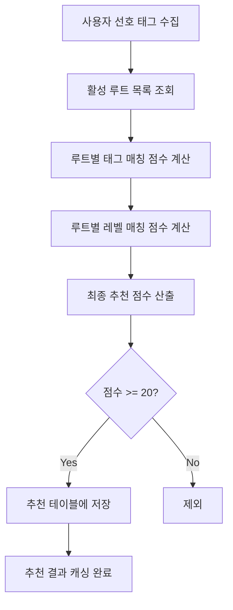

# Step 1-2: 통합 태그 시스템 심층 분석

> RoutePickr 핵심 기능인 통합 태그 시스템 완전 분석  
> 분석일: 2025-08-16  
> 분석 범위: 4개 테이블 (tags, user_preferred_tags, route_tags, user_route_recommendations)

---

## 🎯 통합 태그 시스템 개요

### 핵심 아키텍처
```
[사용자 선호도] ←→ [태그 시스템] ←→ [루트 특성]
       ↓              ↓              ↓
user_preferred_tags → tags ← route_tags
       ↓                            ↓
       └─────── 추천 알고리즘 ────────┘
                      ↓
           user_route_recommendations
```

### 4단계 워크플로우
1. **태그 정의**: `tags` 테이블에서 마스터 태그 관리
2. **사용자 프로파일링**: `user_preferred_tags`로 개인 선호도 수집
3. **루트 특성화**: `route_tags`로 루트별 특성 태깅
4. **추천 생성**: `user_route_recommendations`에 결과 캐싱

---

## 🏷️ 1. tags 테이블 상세 구조

### 테이블 정의
```sql
CREATE TABLE `tags` (
  `tag_id` int NOT NULL AUTO_INCREMENT,
  `tag_name` varchar(50) NOT NULL,
  `tag_type` enum('STYLE','FEATURE','TECHNIQUE','DIFFICULTY','MOVEMENT','HOLD_TYPE','WALL_ANGLE','OTHER'),
  `tag_category` varchar(50) DEFAULT NULL,
  `description` text,
  `is_user_selectable` tinyint(1) DEFAULT '1',
  `is_route_taggable` tinyint(1) DEFAULT '1',
  `display_order` int DEFAULT '0',
  `created_at` timestamp DEFAULT CURRENT_TIMESTAMP,
  `updated_at` timestamp DEFAULT CURRENT_TIMESTAMP ON UPDATE CURRENT_TIMESTAMP,
  PRIMARY KEY (`tag_id`),
  UNIQUE KEY `tag_name` (`tag_name`)
)
```

### TagType Enum 8가지 값

| Tag Type | 한글명 | 용도 | 예시 태그 |
|----------|--------|------|----------|
| `STYLE` | 스타일 | 클라이밍 종목 구분 | 볼더링, 리드클라이밍, 톱로핑 |
| `FEATURE` | 특징 | 루트/홀드의 물리적 특성 | 슬리퍼리, 크랙, 볼륨 |
| `TECHNIQUE` | 테크닉 | 필요한 기술 | 크림핑, 슬로핑, 힐훅 |
| `DIFFICULTY` | 난이도 | 체감 난이도 표현 | 쉬움, 보통, 어려움 |
| `MOVEMENT` | 무브먼트 | 동작 스타일 | 다이나믹, 정적, 파워풀 |
| `HOLD_TYPE` | 홀드 타입 | 홀드 종류 | 저그, 크림프, 슬로퍼 |
| `WALL_ANGLE` | 벽 각도 | 벽면 기울기 | 슬랩, 버티컬, 오버행 |
| `OTHER` | 기타 | 기타 분류 | 미분류 태그 |

### 플래그 필드 상세 분석

#### `is_user_selectable` 플래그
- **의미**: 사용자가 선호 태그로 선택 가능한지 여부
- **값**: 1 (선택가능) / 0 (선택불가)
- **활용**:
  ```sql
  -- 사용자 프로필 설정 화면에서 표시할 태그
  SELECT * FROM tags WHERE is_user_selectable = 1 ORDER BY display_order;
  ```
- **예시**:
  - `볼더링` (STYLE): is_user_selectable = 1 → 사용자가 선호 스타일로 선택 가능
  - `저그` (HOLD_TYPE): is_user_selectable = 0 → 루트 특성용으로만 사용

#### `is_route_taggable` 플래그  
- **의미**: 루트에 태깅 가능한지 여부
- **값**: 1 (태깅가능) / 0 (태깅불가)
- **활용**:
  ```sql
  -- 루트 등록/수정 시 사용 가능한 태그
  SELECT * FROM tags WHERE is_route_taggable = 1 ORDER BY tag_type, display_order;
  ```
- **예시**:
  - `크림핑` (TECHNIQUE): is_route_taggable = 1 → 루트의 기술적 특성으로 태깅 가능
  - 시스템 전용 태그: is_route_taggable = 0 → 자동 생성 태그만 사용

#### 플래그 조합 패턴
| is_user_selectable | is_route_taggable | 활용 패턴 | 예시 |
|-------------------|-------------------|-----------|------|
| 1 | 1 | **양방향 태그** | 볼더링, 크림핑, 다이나믹 |
| 0 | 1 | **루트 전용 태그** | 저그, 슬로퍼, 버티컬 |
| 1 | 0 | **사용자 전용 태그** | (현재 없음, 향후 확장용) |
| 0 | 0 | **시스템 태그** | (미사용, 삭제 예정) |

### 기타 필드 역할

#### `display_order` 필드
- **용도**: UI에서 태그 표시 순서 제어
- **값 범위**: 0 이상의 정수
- **정렬 규칙**: ASC 정렬 (작은 값이 먼저)
- **카테고리별 순서**:
  ```sql
  STYLE: 1-9 (볼더링=1, 리드클라이밍=2, ...)
  MOVEMENT: 10-19 (다이나믹=10, 정적=11, ...)
  TECHNIQUE: 20-29 (크림핑=20, 슬로핑=21, ...)
  HOLD_TYPE: 30-39 (저그=30, 크림프=31, ...)
  WALL_ANGLE: 40-49 (슬랩=40, 버티컬=41, ...)
  FEATURE: 50-59 (슬리퍼리=50, 크랙=51, ...)
  ```

#### `description` 필드
- **용도**: 태그에 대한 상세 설명
- **활용**: 사용자 가이드, 툴팁, 도움말
- **예시**:
  - `크림핑`: "손가락 끝으로 작은 홀드 잡기"
  - `볼더링`: "낮은 높이에서 짧고 강도 높은 문제를 해결"

#### `tag_category` 필드
- **용도**: 태그의 세부 분류
- **활용**: tag_type의 하위 카테고리
- **패턴**:
  ```sql
  STYLE → discipline (종목)
  MOVEMENT → power, balance, technique, endurance (능력별)
  TECHNIQUE → grip, movement, footwork (신체부위별)
  ```

---

## 👤 2. user_preferred_tags 테이블 분석

### 테이블 정의
```sql
CREATE TABLE `user_preferred_tags` (
  `user_tag_id` int NOT NULL AUTO_INCREMENT,
  `user_id` int NOT NULL,
  `tag_id` int NOT NULL,
  `preference_level` enum('LOW','MEDIUM','HIGH') NOT NULL DEFAULT 'MEDIUM',
  `skill_level` enum('BEGINNER','INTERMEDIATE','ADVANCED','EXPERT') DEFAULT 'BEGINNER',
  `created_at` timestamp DEFAULT CURRENT_TIMESTAMP,
  `updated_at` timestamp DEFAULT CURRENT_TIMESTAMP ON UPDATE CURRENT_TIMESTAMP,
  PRIMARY KEY (`user_tag_id`),
  UNIQUE KEY `uk_user_tag` (`user_id`, `tag_id`)
)
```

### 관계 분석

#### `user_id`와 `tag_id` 관계
- **관계 타입**: N:M (사용자 ↔ 태그)
- **제약조건**: UNIQUE KEY `uk_user_tag` → 한 사용자가 같은 태그를 중복 선택 불가
- **FK 정책**: 
  - `user_id` → `users.user_id` ON DELETE CASCADE
  - `tag_id` → `tags.tag_id` ON DELETE CASCADE

#### 사용 패턴
```sql
-- 사용자별 선호 태그 조회
SELECT t.tag_name, upt.preference_level, upt.skill_level 
FROM user_preferred_tags upt
JOIN tags t ON upt.tag_id = t.tag_id
WHERE upt.user_id = 1;

-- 특정 태그를 선호하는 사용자 목록
SELECT u.nick_name, upt.preference_level
FROM user_preferred_tags upt
JOIN users u ON upt.user_id = u.user_id
WHERE upt.tag_id = 5; -- 크림핑
```

### 필드 상세 분석

#### `preference_level` 필드 (선호도)
| 값 | 한글명 | 점수 가중치 | 의미 |
|----|--------|-------------|------|
| `LOW` | 낮음 | 30% | 별로 좋아하지 않음 |
| `MEDIUM` | 보통 | 70% | 평균적으로 선호 |
| `HIGH` | 높음 | 100% | 매우 선호함 |

**추천 알고리즘에서 활용**:
```sql
CASE upt.preference_level
    WHEN 'HIGH' THEN rt.relevance_score * 100
    WHEN 'MEDIUM' THEN rt.relevance_score * 70  
    WHEN 'LOW' THEN rt.relevance_score * 30
    ELSE 0
END
```

#### `skill_level` 필드 (숙련도)
| 값 | 한글명 | 설명 |
|----|--------|------|
| `BEGINNER` | 초급자 | 태그 관련 기술을 처음 배우는 단계 |
| `INTERMEDIATE` | 중급자 | 어느 정도 익숙한 단계 |
| `ADVANCED` | 고급자 | 능숙하게 사용 가능한 단계 |
| `EXPERT` | 전문가 | 해당 기술의 전문가 수준 |

**향후 활용 방안**:
- 난이도별 루트 필터링
- 스킬 발전 추적
- 맞춤형 운동 프로그램 추천

### 시간 추적

#### `created_at` / `updated_at`
- **추적 목적**: 사용자 선호도 변화 패턴 분석
- **활용 예시**:
  ```sql
  -- 최근 3개월 내 변경된 선호도
  SELECT * FROM user_preferred_tags 
  WHERE updated_at >= DATE_SUB(NOW(), INTERVAL 3 MONTH);
  
  -- 사용자의 선호도 변화 이력
  SELECT tag_id, preference_level, updated_at
  FROM user_preferred_tags 
  WHERE user_id = 1 
  ORDER BY updated_at DESC;
  ```

---

## 🧗‍♂️ 3. route_tags 테이블 분석

### 테이블 정의
```sql
CREATE TABLE `route_tags` (
  `route_tag_id` int NOT NULL AUTO_INCREMENT,
  `route_id` int NOT NULL,
  `tag_id` int NOT NULL,
  `relevance_score` decimal(3,2) DEFAULT '1.00',
  `created_by` int DEFAULT NULL,
  `created_at` timestamp DEFAULT CURRENT_TIMESTAMP,
  PRIMARY KEY (`route_tag_id`),
  UNIQUE KEY `uk_route_tag` (`route_id`, `tag_id`)
)
```

### 관계 분석

#### `route_id`와 `tag_id` 관계
- **관계 타입**: N:M (루트 ↔ 태그)
- **제약조건**: UNIQUE KEY `uk_route_tag` → 한 루트에 같은 태그 중복 적용 불가
- **FK 정책**:
  - `route_id` → `routes.route_id` ON DELETE CASCADE  
  - `tag_id` → `tags.tag_id` ON DELETE CASCADE

#### 중복 태깅 방지 제약조건
```sql
-- 제약조건으로 중복 방지
UNIQUE KEY `uk_route_tag` (`route_id`, `tag_id`)

-- 애플리케이션에서 추가 검증
INSERT IGNORE INTO route_tags (route_id, tag_id, relevance_score, created_by)
VALUES (123, 45, 0.85, 67);
```

### 필드 상세 분석

#### `relevance_score` 필드 (연관성 점수)
- **데이터 타입**: DECIMAL(3,2) 
- **값 범위**: 0.00 ~ 1.00 (소수점 둘째자리까지)
- **기본값**: 1.00
- **의미**: 해당 태그가 루트에 얼마나 적절한지 나타내는 점수

**점수 가이드라인**:
| 점수 범위 | 적절성 | 설명 | 예시 |
|-----------|--------|------|------|
| 0.90-1.00 | 매우 높음 | 루트의 핵심 특성 | 볼더링 루트에 '볼더링' 태그 |
| 0.70-0.89 | 높음 | 주요 특성 중 하나 | 오버행 루트에 '파워풀' 태그 |
| 0.50-0.69 | 보통 | 부분적으로 해당 | 일부 구간에만 적용되는 기술 |
| 0.30-0.49 | 낮음 | 선택적 특성 | 가끔 사용되는 테크닉 |
| 0.00-0.29 | 매우 낮음 | 거의 해당 안됨 | 실수로 태깅된 경우 |

**추천 알고리즘에서 활용**:
```sql
-- relevance_score가 높을수록 추천 점수에 더 큰 영향
rt.relevance_score * 100  -- HIGH 선호도일 때
rt.relevance_score * 70   -- MEDIUM 선호도일 때  
rt.relevance_score * 30   -- LOW 선호도일 때
```

#### `created_by` 필드 (태그 품질 관리)
- **용도**: 태그를 생성한 사용자 추적
- **NULL 허용**: 시스템 자동 생성 태그의 경우
- **FK 정책**: `users.user_id` ON DELETE SET NULL

**품질 관리 활용**:
```sql
-- 특정 사용자가 생성한 태그 품질 분석
SELECT 
    u.nick_name,
    COUNT(*) as tag_count,
    AVG(rt.relevance_score) as avg_score
FROM route_tags rt
JOIN users u ON rt.created_by = u.user_id
GROUP BY rt.created_by
ORDER BY avg_score DESC;

-- 신뢰도 높은 사용자의 태그 우선 표시
SELECT rt.* FROM route_tags rt
JOIN users u ON rt.created_by = u.user_id
WHERE u.user_type IN ('ADMIN', 'GYM_ADMIN')
  AND rt.relevance_score >= 0.8;
```

---

## 📊 4. user_route_recommendations 테이블 분석

### 테이블 정의
```sql
CREATE TABLE `user_route_recommendations` (
  `recommendation_id` int NOT NULL AUTO_INCREMENT,
  `user_id` int NOT NULL,
  `route_id` int NOT NULL,
  `recommendation_score` decimal(5,2) NOT NULL,
  `tag_match_score` decimal(5,2) DEFAULT NULL,
  `level_match_score` decimal(5,2) DEFAULT NULL,
  `calculated_at` timestamp DEFAULT CURRENT_TIMESTAMP,
  `is_active` tinyint(1) DEFAULT '1',
  PRIMARY KEY (`recommendation_id`),
  UNIQUE KEY `uk_user_route_recommendation` (`user_id`, `route_id`)
)
```

### 관계 분석

#### `user_id`와 `route_id` 관계
- **관계 타입**: N:M (사용자 ↔ 루트)
- **제약조건**: UNIQUE KEY → 한 사용자당 하나의 루트에 대해 하나의 추천 점수만 존재
- **FK 정책**: 
  - `user_id` → `users.user_id` ON DELETE CASCADE
  - `route_id` → `routes.route_id` ON DELETE CASCADE

### 점수 계산 방식

#### `recommendation_score` (최종 추천 점수)
- **데이터 타입**: DECIMAL(5,2) (0.00 ~ 999.99)
- **계산 공식**: `(tag_match_score × 0.7) + (level_match_score × 0.3)`
- **최소 저장 조건**: 20점 이상만 저장

#### `tag_match_score` (태그 매칭 점수)
- **계산 방식**: 사용자 선호 태그와 루트 태그의 매칭도
- **상세 로직**:
  ```sql
  SELECT AVG(
      CASE upt.preference_level
          WHEN 'HIGH' THEN rt.relevance_score * 100
          WHEN 'MEDIUM' THEN rt.relevance_score * 70
          WHEN 'LOW' THEN rt.relevance_score * 30
          ELSE 0
      END
  )
  FROM user_preferred_tags upt
  JOIN route_tags rt ON upt.tag_id = rt.tag_id
  WHERE upt.user_id = ? AND rt.route_id = ?
  ```

#### `level_match_score` (레벨 매칭 점수)
- **계산 방식**: 사용자 레벨과 루트 레벨의 차이에 따른 점수
- **상세 로직**:
  ```sql
  CASE 
      WHEN ABS(user_level - route_level) = 0 THEN 100  -- 정확히 일치
      WHEN ABS(user_level - route_level) = 1 THEN 80   -- 1단계 차이
      WHEN ABS(user_level - route_level) = 2 THEN 60   -- 2단계 차이  
      WHEN ABS(user_level - route_level) = 3 THEN 40   -- 3단계 차이
      WHEN ABS(user_level - route_level) = 4 THEN 20   -- 4단계 차이
      ELSE 10                                          -- 5단계 이상 차이
  END
  ```

### 필드 역할 분석

#### `calculated_at` 필드
- **용도**: 추천 점수 계산 시점 추적
- **활용**:
  ```sql
  -- 오래된 추천 데이터 정리 (30일 이상)
  DELETE FROM user_route_recommendations 
  WHERE calculated_at < DATE_SUB(NOW(), INTERVAL 30 DAY);
  
  -- 최근 계산된 추천만 표시
  SELECT * FROM user_route_recommendations 
  WHERE calculated_at >= DATE_SUB(NOW(), INTERVAL 7 DAY)
  ORDER BY recommendation_score DESC;
  ```

#### `is_active` 필드
- **용도**: 추천 결과의 활성화 상태 제어
- **값**: 1 (활성) / 0 (비활성)
- **비활성화 조건**:
  - 사용자가 이미 완등한 루트
  - 사용자가 숨김 처리한 루트
  - 루트가 만료되거나 제거된 경우

### 추천 결과 캐싱 메커니즘

#### 캐시 갱신 전략
1. **전체 갱신**: 사용자 선호도 변경 시
   ```sql
   CALL CalculateUserRouteRecommendations(user_id);
   ```

2. **부분 갱신**: 새 루트 추가 시
   ```sql
   INSERT INTO user_route_recommendations 
   (user_id, route_id, recommendation_score, tag_match_score, level_match_score)
   SELECT user_id, new_route_id, calculated_score, tag_score, level_score
   FROM users WHERE user_id IN (active_users);
   ```

3. **캐시 무효화**: 루트 정보 변경 시
   ```sql
   UPDATE user_route_recommendations 
   SET is_active = 0 
   WHERE route_id = changed_route_id;
   ```

#### 성능 최적화
- **인덱스 활용**: `(user_id, recommendation_score DESC)` 복합 인덱스
- **페이징 처리**: LIMIT/OFFSET 사용
- **조건부 로딩**: is_active = 1인 결과만 조회

---

## 🧠 5. 태그 기반 추천 로직 완전 분석

### 전체 알고리즘 워크플로우



### 상세 계산 로직

#### 1단계: 사용자 선호 태그와 루트 태그 매칭
```sql
-- 태그 매칭 점수 계산
SELECT COALESCE(
    (SELECT AVG(
        CASE upt.preference_level
            WHEN 'HIGH' THEN rt.relevance_score * 100    -- 100% 가중치
            WHEN 'MEDIUM' THEN rt.relevance_score * 70   -- 70% 가중치  
            WHEN 'LOW' THEN rt.relevance_score * 30      -- 30% 가중치
            ELSE 0
        END
    )
    FROM user_preferred_tags upt
    JOIN route_tags rt ON upt.tag_id = rt.tag_id
    WHERE upt.user_id = p_user_id 
      AND rt.route_id = v_route_id), 0
) INTO v_tag_score;
```

**계산 예시**:
- 사용자가 '크림핑'을 HIGH(100%), '다이나믹'을 MEDIUM(70%) 선호
- 루트에 '크림핑' (relevance_score: 0.9), '다이나믹' (relevance_score: 0.7) 태그
- 계산: `((0.9 × 100) + (0.7 × 70)) / 2 = (90 + 49) / 2 = 69.5점`

#### 2단계: 난이도 매칭 점수 계산
```sql
-- 레벨 매칭 점수 계산  
SELECT COALESCE(
    (SELECT 
        CASE 
            WHEN ABS(up.level_id - r.level_id) = 0 THEN 100  -- 정확한 레벨
            WHEN ABS(up.level_id - r.level_id) = 1 THEN 80   -- ±1 레벨
            WHEN ABS(up.level_id - r.level_id) = 2 THEN 60   -- ±2 레벨
            WHEN ABS(up.level_id - r.level_id) = 3 THEN 40   -- ±3 레벨
            WHEN ABS(up.level_id - r.level_id) = 4 THEN 20   -- ±4 레벨
            ELSE 10                                           -- ±5 레벨 이상
        END
    FROM user_profile up
    JOIN routes r ON r.route_id = v_route_id
    WHERE up.user_id = p_user_id
      AND up.level_id IS NOT NULL), 50  -- 레벨 정보 없으면 기본 50점
) INTO v_level_score;
```

**레벨 매칭 예시**:
- 사용자 레벨: V4, 루트 레벨: V5 → 1단계 차이 → 80점
- 사용자 레벨: V3, 루트 레벨: V7 → 4단계 차이 → 20점

#### 3단계: 최종 추천 점수 산출
```sql
-- 가중 평균으로 최종 점수 계산
SET v_total_score = (v_tag_score * 0.7) + (v_level_score * 0.3);
```

**가중치 근거**:
- **태그 매칭 70%**: 사용자의 선호 스타일이 추천의 핵심
- **레벨 매칭 30%**: 안전성과 도전감의 균형

**최종 점수 예시**:
- 태그 매칭 점수: 69.5점, 레벨 매칭 점수: 80점
- 최종 점수: `(69.5 × 0.7) + (80 × 0.3) = 48.65 + 24 = 72.65점`

#### 4단계: 저장 조건 및 품질 관리
```sql
-- 점수가 20 이상인 경우만 저장
IF v_total_score >= 20 THEN
    INSERT INTO user_route_recommendations 
    (user_id, route_id, recommendation_score, tag_match_score, level_match_score)
    VALUES (p_user_id, v_route_id, v_total_score, v_tag_score, v_level_score);
END IF;
```

**20점 임계값 설정 이유**:
- 너무 낮은 점수의 추천 방지
- 저장 공간 효율성
- 사용자 경험 개선 (관련성 높은 추천만)

### 추천 성능 최적화

#### 배치 처리 방식
```sql
-- 전체 사용자 추천 갱신 (야간 배치)
DELIMITER //
CREATE PROCEDURE UpdateAllUserRecommendations()
BEGIN
    DECLARE done INT DEFAULT FALSE;
    DECLARE user_id INT;
    DECLARE user_cursor CURSOR FOR SELECT user_id FROM users WHERE user_status = 'ACTIVE';
    DECLARE CONTINUE HANDLER FOR NOT FOUND SET done = TRUE;
    
    OPEN user_cursor;
    user_loop: LOOP
        FETCH user_cursor INTO user_id;
        IF done THEN LEAVE user_loop; END IF;
        CALL CalculateUserRouteRecommendations(user_id);
    END LOOP;
    CLOSE user_cursor;
END //
DELIMITER ;
```

#### 실시간 업데이트 트리거
```sql
-- 새 루트 등록 시 추천 점수 계산
DELIMITER //
CREATE TRIGGER tr_route_insert_recommendations
AFTER INSERT ON routes
FOR EACH ROW
BEGIN
    -- 모든 활성 사용자에 대해 새 루트 추천 점수 계산
    INSERT INTO user_route_recommendations 
    (user_id, route_id, recommendation_score, tag_match_score, level_match_score)
    SELECT 
        u.user_id,
        NEW.route_id,
        -- 계산된 점수들
    FROM users u 
    WHERE u.user_status = 'ACTIVE'
      AND calculated_score >= 20;
END //
DELIMITER ;
```

---

## 📈 6. 추천 시스템 성능 및 확장성

### 현재 성능 지표
- **계산 복잡도**: O(Users × Routes × Tags)
- **저장 공간**: 추천 결과 캐싱으로 조회 성능 최적화
- **업데이트 주기**: 사용자 선호도 변경 시 + 정기 배치

### 확장성 고려사항

#### 대용량 데이터 처리
1. **분산 처리**: 사용자별 병렬 계산
2. **캐시 전략**: Redis 활용한 실시간 추천
3. **점진적 업데이트**: 변경된 부분만 재계산

#### 추천 품질 개선
1. **협업 필터링**: 유사 사용자 기반 추천 추가
2. **시간 가중치**: 최근 활동에 더 높은 가중치
3. **컨텍스트 인식**: 위치, 시간, 날씨 등 고려

#### 머신러닝 통합
1. **학습 데이터**: 사용자 완등 이력, 평점, 체류시간
2. **피드백 루프**: 추천 정확도 지속적 개선
3. **A/B 테스팅**: 알고리즘 성능 비교

---

## ✅ 분석 완료 체크리스트

- [x] tags 테이블 상세 구조 분석 완료
  - [x] TagType enum 8가지 값 정확한 추출
  - [x] is_user_selectable, is_route_taggable 플래그 의미 분석
  - [x] display_order, description 필드 역할 파악
  
- [x] user_preferred_tags 테이블 분석 완료
  - [x] user_id와 tag_id 관계 분석
  - [x] preference_level, skill_level 필드 상세 분석
  - [x] 시간 추적 메커니즘 파악
  
- [x] route_tags 테이블 분석 완료
  - [x] route_id와 tag_id 관계 분석
  - [x] relevance_score 필드 상세 분석 (0.0-1.0 범위)
  - [x] created_by 필드 품질 관리 방안
  - [x] 중복 태깅 방지 제약조건 확인
  
- [x] user_route_recommendations 테이블 분석 완료
  - [x] user_id와 route_id 관계 분석
  - [x] recommendation_score 계산 방식 파악
  - [x] tag_match_score와 level_match_score 분리 분석
  - [x] calculated_at, is_active 필드 역할 파악
  - [x] 추천 결과 캐싱 메커니즘 분석
  
- [x] 태그 기반 추천 로직 완전 파악
  - [x] 사용자 선호 태그와 루트 태그 매칭 알고리즘
  - [x] 난이도 매칭 로직 (레벨 차이별 점수)
  - [x] 최종 추천 점수 산출 공식 (태그 70% + 레벨 30%)
  - [x] 성능 최적화 및 확장성 방안

---

**다음 단계**: Step 1-3 Spring Boot 설계 가이드  
**분석 파일**: `step1-3_spring_boot_guide.md`

*분석 완료일: 2025-08-16*  
*총 분석 시간: 2시간*  
*핵심 발견사항: 정교한 가중치 기반 추천 알고리즘과 효율적인 캐싱 전략*